# 🎓 CampSpark ERP System

CampSpark is an AI-powered College Management ERP System developed using Django, PostgreSQL, Bootstrap, and Python. The platform automates academic and administrative activities and provides a centralized system for students, faculty, and administrators.

---

# 🚀 Features

- Student Management
- Staff Management
- Attendance Tracking
- Fee Management
- Library Management
- Event Management
- Complaint Management
- AI Assistant Chatbot
- Notifications & Smart Reminders
- Dashboard Analytics
- Student Project Management
- Report Generation
- Role-Based Authentication
- Cloud Deployment Support

---

# 🛠 Technology Stack

## Backend
- Python
- Django

## Frontend
- HTML
- CSS
- Bootstrap
- JavaScript

## Database
- PostgreSQL
- SQLite

## Tools & Services
- GitHub
- Railway
- Chart.js
- Whitenoise

---

# 📂 System Modules

- Authentication & User Roles
- Student Dashboard
- Staff Dashboard
- Admin Panel
- Attendance Module
- Fee Management Module
- Library Module
- Event Management Module
- Complaint & Grievance Module
- Notification System
- Reports & Analytics
- Student Project Management
- AI Assistant Module

---

# 🤖 AI Integration

CampSpark includes an AI-powered chatbot that provides intelligent assistance and improves user interaction inside the ERP platform.

---

# 📸 System Screenshots

## Login Page

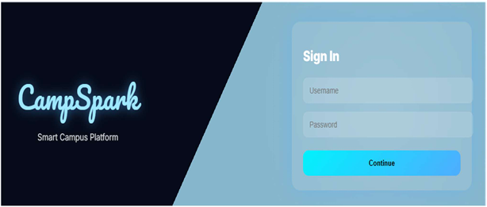

## Student Dashboard

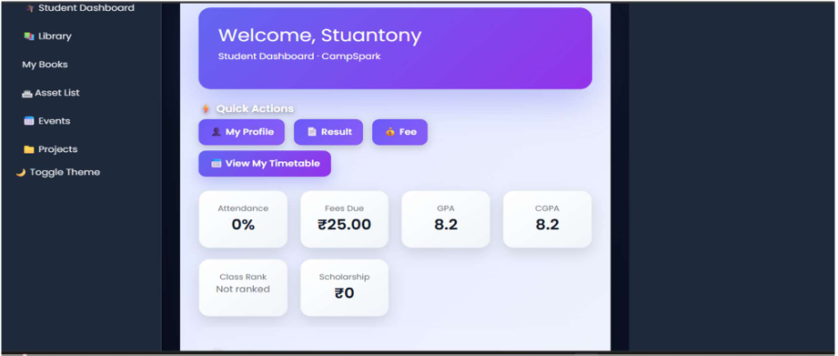

## Staff Dashboard

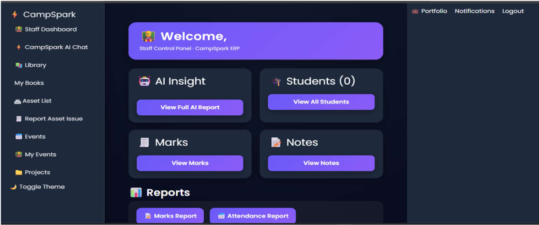

## Admin Dashboard

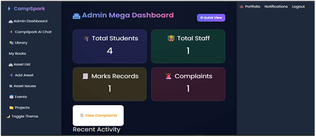

## AI Assistant

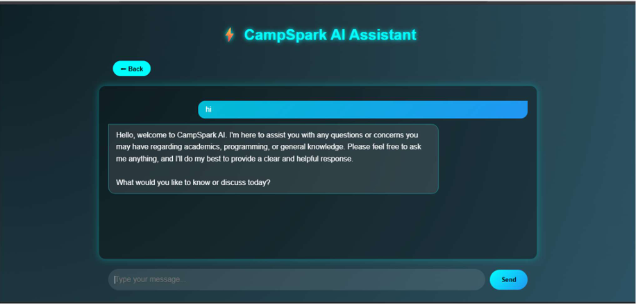

## Complaint Management

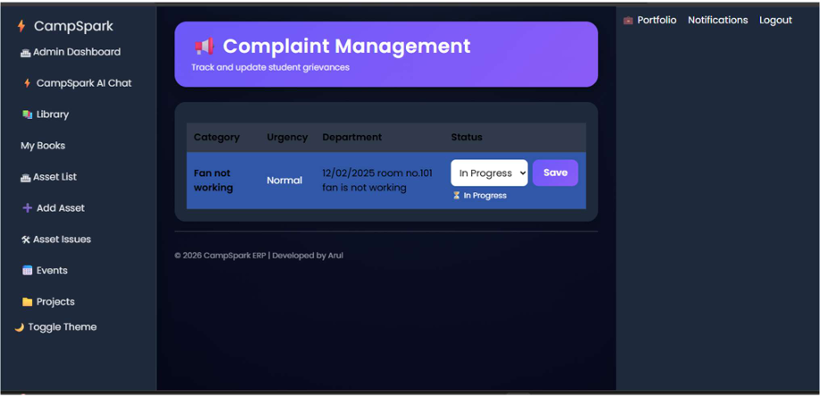

## Event Management

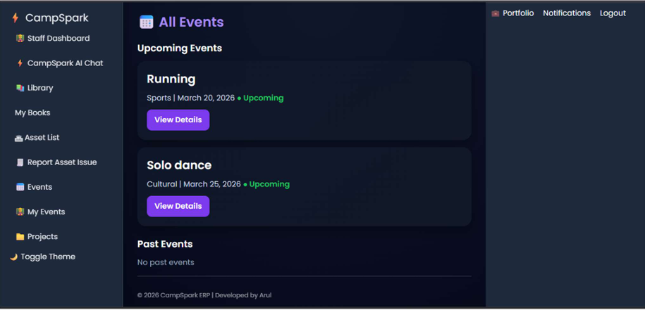

## Library Module

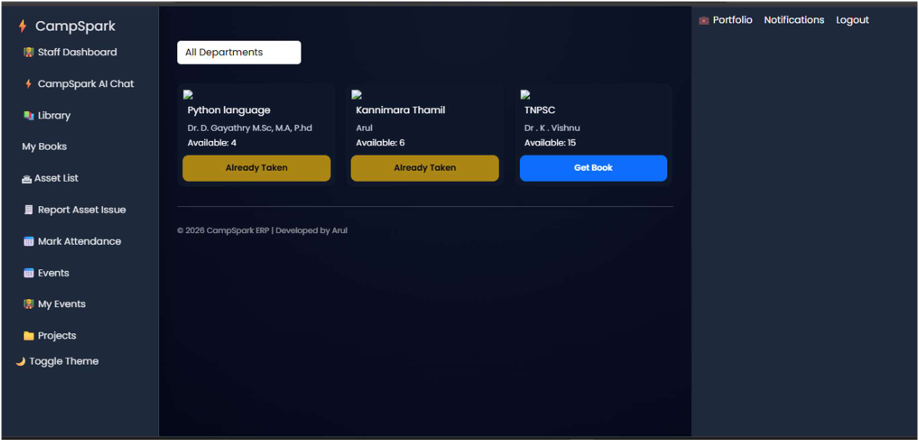

## Notifications

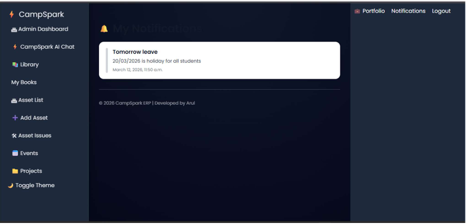

## Smart Reminder Popup

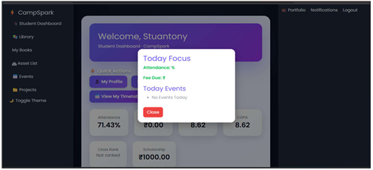

## Project Management

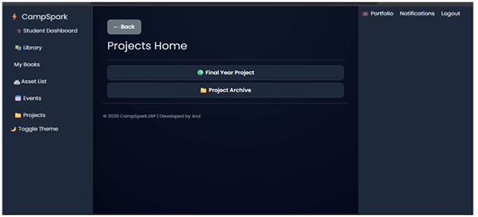

---

# ⚙ Installation

Clone repository:

```bash
git clone https://github.com/Dominicsavio6506/CampSpark.git
```

Install dependencies:

```bash
pip install -r requirements.txt
```

Run migrations:

```bash
python manage.py migrate
```

Start the server:

```bash
python manage.py runserver
```

---

# ☁ Deployment

CampSpark has been deployed using Railway cloud hosting with PostgreSQL database support.

---

# 🔮 Future Enhancements

- Mobile Application
- Advanced AI Analytics
- Multi-College Support
- Biometric Attendance
- Enhanced Security Features
- Android Application
- AI-based Student Performance Prediction

---

# 👨‍💻 Developer

### Arul

**B.Sc Computer Science**

Government Arts and Science College, Manapparai

### Skills

- Python
- Django
- PostgreSQL
- Bootstrap
- HTML
- CSS
- JavaScript
- AI Integration
- REST API

### GitHub

https://github.com/Dominicsavio6506

### LinkedIn

https://www.linkedin.com/in/dominic-savio-66b5792ba

---

## ⭐ If you found this project useful, consider giving it a star.
